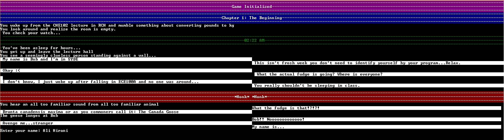

# Goose Apocalypse - EngHack 2014

This console based game was a 24+ hour collaborative effort.
It was an exercise in Git collaboration and objected oriented programming in C#.
The game was designed and planned out on paper and it's development was executed thereafter.
Many lessons were learned with respect to team-based development and code collaboration.

Find a screenshot of the introductory sequence below.

